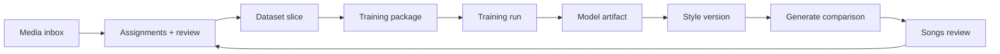

# Training Pipeline Roadmap — Workbench Implementation Proposal

## Summary

Workbench today exposes **Download training package**, which exports a client-side JSON manifest only. It does not include audio, does not persist a dataset slice, and nothing in the backend consumes it. Training is the intended downstream 20% of the platform, but the live pipeline is not wired yet.

This document proposes a phased implementation to turn Workbench into the operating surface for:

```txt
curated media → dataset slice → training run → style version → comparison generate → review
```

The goal is not a separate training app. Workbench remains the slice builder and training launcher; Generate and Songs remain the evaluation surfaces.

---

## Current state

| Layer | What exists | Gap |
|---|---|---|
| Taxonomy | 474 seeded categories, concepts, assignments | No slice entity |
| Media | Import, review, category/concept tagging | No rights gate for training |
| Workbench | Track picker, localStorage selection, JSON export stub | No server-side slice or run |
| Generation | Job lifecycle, ACE command bridge, version details | No `style_version_id` / LoRA path |
| Bundle export | ZIP with WAV + metadata for **generated** jobs | Different from training dataset export |
| Docs | `DatasetSlice`, `TrainingRun`, `StyleVersion` schemas proposed | Not implemented in code |

Relevant stub code today:

- `app/web/static/assets/js/workbench.js` — builds JSON in-browser, no API call
- `app/web/static/assets/js/workbench-sessions.js` — selection stored in `localStorage` only
- `app/services/generation_service.py` — `trainingRunId: None` placeholder in version details

---

## Product goals

### Primary

1. User can build a **dataset slice** from reviewed, rights-cleared media filtered by concept/categories/roles/quality.
2. User can launch a **training run** from Workbench against ACE-Step base model.
3. System tracks run status, logs, and produced **model artifacts**.
4. User can promote an artifact to a **style version** and target it from Generate.
5. User can run **comparison generations** (baseline vs style version) and review in Songs.

### First calibration target

Per `01_PM_BRIEF.md`, prove the loop with a small experiment before scaling:

- **8–12 focused tracks**
- **One narrow concept**
- **Reviewed media only** with quality/fit scores
- **Baseline generations saved first**
- Clear promotion/reject decision on the style version

### Non-goals (this roadmap)

- Multi-user auth, billing, cloud GPU fleet
- Real-time loss charts or advanced LoRA hyperparameter UI
- Automatic audio tagging or stem separation as training prerequisites
- Training on media marked `DO_NOT_TRAIN` or `UNKNOWN` rights
- Replacing Generate/Songs with a training dashboard

---

## Prerequisites (Phase 0 gates)

Do not start subprocess training until these are stable:

| Gate | Rationale |
|---|---|
| Media import + playback works | Training needs source WAV paths |
| Category/concept assignment + review flow works | Slice quality depends on curation |
| ACE generation succeeds locally at `balanced`/`high` | Base model must be proven before fine-tune |
| `GenerationRequest` persists `concept_id`, category targets | Comparison runs need reproducible targets |
| Rights status visible on media detail | Legal guardrail before train |

**Exit criteria:** User can import 8 tracks, tag them to one concept, mark reviewed, generate one baseline ACE song, and review it in Songs.

---

## Target architecture

### Pipeline overview



### Adapter seam

Extend the generator adapter contract from `02_ARCHITECTURE_PROPOSALS.md`:

```python
class TrainingAdapter(Protocol):
    name: str
    supports_lora: bool

    def validate_dataset(self, package_path: Path) -> None: ...
    def start_training(self, request: TrainingRequest, package_path: Path, output_dir: Path) -> None: ...
    def poll_training(self, run_dir: Path) -> TrainingPollResult: ...
    def cancel_training(self, run_dir: Path) -> None: ...
```

First implementation: **`ace-step-lora`** subprocess bridge, mirroring `scripts/ace_runner.py` and `app/generators/ace_step/adapter.py`. Procedural adapter does not implement training.

### Storage layout

Add under `DATA_DIR` (from `app/core/paths.py`):

```txt
data/
  slices/
    {slice_id}/
      slice.json                 # DatasetSlice record
      manifest.json              # frozen member list + taxonomy snapshot
      audio/                     # copied or symlinked WAVs at slice freeze time
        {media_id}.wav
        {media_id}.json          # per-track captions / labels
  training_runs/
    {run_id}/
      run.json                   # TrainingRun record
      config.json                # hyperparams snapshot
      package/                   # input package sent to trainer
      logs/
        train.log
      artifacts/
        lora.safetensors         # or checkpoint dir
        metrics.json
  style_versions/
    {style_version_id}.json
```

JSON-first persistence matches existing stores (`category_store`, `local_job_store`). SQLite migration can wait.

### Core entities

Implement Pydantic models in `app/domain/training.py` (new file):

#### DatasetSlice

| Field | Notes |
|---|---|
| `id` | `slice_{uuid}` |
| `name`, `slug`, `description` | User-facing |
| `concept_id` | Optional; preferred filter anchor |
| `filter` | `{ category_ids, roles, min_quality, min_fit, review_status, rights_status }` |
| `media_ids` | Frozen ordered list at save/refresh |
| `status` | `DRAFT` → `READY` → `ARCHIVED` |
| `version` | Increment on refresh |
| `asset_count` | Denormalized |

#### TrainingRun

| Field | Notes |
|---|---|
| `id` | `train_{uuid}` |
| `name` | User label |
| `dataset_slice_id` | Required |
| `backend` | `ACE_STEP` initially |
| `base_model_version` | From settings / model status |
| `status` | Reuse `JobStatus` enum |
| `config` | Steps, rank, lr, epochs — small fixed schema v1 |
| `style_version_id` | Set on success |
| `error`, `started_at`, `finished_at` | Lifecycle |

#### StyleVersion

| Field | Notes |
|---|---|
| `id` | `style_{uuid}` |
| `name`, `slug`, `version` | User-facing |
| `training_run_id`, `dataset_slice_id` | Lineage |
| `artifact_path` | Relative to `data/` |
| `status` | `CANDIDATE` → `PROMOTED` → `ARCHIVED` |
| `backend` | `ACE_STEP` |

Wire optional IDs already reserved in version details:

- `training_run_id`
- `dataset_slice_id`
- `style_version_id` (add to `GenerationRequest` and version details)

---

## Real training package format

Replace the browser-only JSON stub with a **server-built ZIP** at slice freeze or run start.

### Contents

```txt
training-package/
  manifest.json          # slice metadata, concept, model target, export version
  tracks/
    {media_id}/
      audio.wav
      labels.json        # categories, concept, role, quality, fit, notes
  captions.csv           # trainer-friendly flat file (path, prompt, tags)
  rights.json            # per-track rights_status snapshot
```

### `manifest.json` (v1)

```json
{
  "format_version": 1,
  "slice_id": "slice_abc",
  "name": "Dark Cinematic Piano Vocal v1",
  "concept_id": "concept_xyz",
  "target_model": {
    "backend": "ACE_STEP",
    "base_model_dir": "/path/to/checkpoints",
    "base_model_version": "ace-step-1.5"
  },
  "track_count": 10,
  "filters": { "min_quality": 3, "min_fit": 4, "roles": ["GOLD_REFERENCE"] },
  "exported_at": "2026-06-27T12:00:00Z"
}
```

### Caption strategy (v1)

Derive training captions from taxonomy, not freeform user prose:

```txt
{c concept name} | {genre categories} | {mood categories} | {vocals categories} | {production categories}
```

Optional per-track `notes` appended when present. Keep deterministic for reproducibility.

---

## Workbench UX evolution

Workbench becomes a **three-panel flow**, still one route (`/workbench/`).

### Panel 1 — Model status (exists)

Keep current ACE readiness card. Add:

- Active **style version** (if any promoted)
- Last **training run** status chip

### Panel 2 — Build slice (new)

| Control | Behavior |
|---|---|
| Concept picker | Primary filter; drives recommended tracks |
| Category filters | Optional refinement by dimension |
| Role filter | Default: `GOLD_REFERENCE`, `TRAINING_CANDIDATE`, `REFERENCE` |
| Min quality / fit | Sliders 1–5 |
| Preview list | Live query of matching eligible media |
| Save slice | Creates/updates `DatasetSlice`, freezes manifest |
| Track checklist | Becomes slice members, not ephemeral localStorage |

Replace `localStorage`-only workspace with server-backed slice selection. Keep localStorage as draft UI state only until slice is saved.

### Panel 3 — Train & evaluate (new)

| Control | Behavior |
|---|---|
| Slice selector | Pick `READY` slice |
| Training config | v1: preset profiles only (`calibration`, `standard`) — no raw hyperparam UI |
| Start training | `POST /api/training/runs` |
| Run status | Poll log tail + status badge |
| Download package | Downloads real ZIP from `GET /api/slices/{id}/package` |
| Promote | Creates `StyleVersion` from succeeded run |
| Compare | Deep-link to Generate with `style_version_id` + fixed comparison prompt set |

### Empty states

| State | Message |
|---|---|
| &lt; 8 eligible tracks | “Add N more reviewed tracks to run calibration training.” |
| Rights unknown on any selected track | Block train; link to media detail |
| Model not ready | Allow slice build; disable Start training |

---

## API surface

New routes under `app/api/routes/`:

### Dataset slices

| Method | Path | Purpose |
|---|---|---|
| `GET` | `/api/slices` | List slices |
| `POST` | `/api/slices` | Create from filters or explicit `media_ids` |
| `GET` | `/api/slices/{id}` | Detail + member preview |
| `PUT` | `/api/slices/{id}` | Update filters, refresh members |
| `POST` | `/api/slices/{id}/freeze` | Copy audio, write manifest, mark `READY` |
| `GET` | `/api/slices/{id}/package` | Download ZIP |
| `GET` | `/api/slices/preview` | Query eligible media without saving |

### Training runs

| Method | Path | Purpose |
|---|---|---|
| `GET` | `/api/training/runs` | List runs |
| `POST` | `/api/training/runs` | Start run from `dataset_slice_id` + config preset |
| `GET` | `/api/training/runs/{id}` | Status, artifact refs, log tail |
| `POST` | `/api/training/runs/{id}/cancel` | Cancel if adapter supports |
| `GET` | `/api/training/runs/{id}/logs` | Stream or paginate log |

### Style versions

| Method | Path | Purpose |
|---|---|---|
| `GET` | `/api/style-versions` | List |
| `POST` | `/api/style-versions` | Promote from run (or manual register v1) |
| `GET` | `/api/style-versions/{id}` | Detail |
| `POST` | `/api/style-versions/{id}/promote` | Mark active for Generate |
| `POST` | `/api/style-versions/{id}/archive` | Retire |

### Generate integration

Extend `POST /api/generate`:

```json
{
  "style_version_id": "style_abc",
  "dataset_slice_id": "slice_xyz",
  "training_run_id": "train_123",
  "purpose": "VERSION_COMPARISON"
}
```

`model-status` should report available style versions and whether ACE LoRA path is configured.

---

## Implementation phases

Each phase is shippable and testable on its own.

### Phase 1 — Dataset slices (backend + minimal UI)

**Goal:** Server-backed slice entity replaces JSON stub semantics.

**Deliverables**

- `app/domain/training.py` — `DatasetSlice` model
- `app/storage/slice_store.py`
- `app/services/slice_service.py` — filter query, preview, freeze
- `app/api/routes/slices.py`
- Workbench: concept/filter UI, preview, save slice
- Tests: slice CRUD, filter logic, idempotent freeze

**Exit criteria:** User saves a named slice from Workbench; `GET /api/slices/{id}/package` returns ZIP with audio + manifest.

---

### Phase 2 — Training package builder

**Goal:** Production-quality export the trainer can consume.

**Deliverables**

- `app/services/training_package_service.py` — ZIP builder (extend patterns from `bundle_service.py`)
- Caption derivation from taxonomy assignments
- Rights enforcement: exclude `DO_NOT_TRAIN`; warn on `UNKNOWN`
- `captions.csv` + per-track `labels.json`
- Workbench: **Download package** hits server endpoint, not client JSON

**Exit criteria:** Exported ZIP validates on disk; manifest round-trips; captions match category assignments.

---

### Phase 3 — Training run orchestration (skeleton)

**Goal:** Persistent run records and job lifecycle without GPU work yet.

**Deliverables**

- `TrainingRun` model + `training_run_store.py`
- `app/services/training_service.py` — create run, state transitions
- `app/api/routes/training.py`
- Simulated adapter (`mock-training`) that writes fake artifact after delay
- Workbench: Start training, status polling, log view
- Single-run lock (same constraint as ACE generation)

**Exit criteria:** Mock run goes `QUEUED → RUNNING → SUCCEEDED`; artifact path recorded; UI shows live status.

---

### Phase 4 — ACE-Step LoRA adapter

**Goal:** Real local fine-tune via subprocess bridge.

**Deliverables**

- Research spike: confirm ACE-Step 1.5 LoRA/fine-tune entrypoint in operator's checkout
- `scripts/ace_train_runner.py` — CLI bridge (parallel to `ace_runner.py`)
- `ACE_TRAIN_COMMAND_TEMPLATE` in settings (same pattern as generation)
- `app/generators/ace_step/training_adapter.py`
- Config presets in `app/domain/training_presets.py`:

  | Preset | Tracks | Steps | Use |
  |---|---:|---:|---|
  | `calibration` | 8–12 | low | First loop proof |
  | `standard` | 12–24 | medium | Default |

- Timeout, log capture, cancel via process group

**Exit criteria:** Calibration preset completes on 8–12 owned tracks; produces loadable LoRA artifact; logs persisted.

**Open spike (week 0):** Document exact ACE-Step train CLI flags, expected outputs, and VRAM floor before coding adapter.

---

### Phase 5 — Style versions + Generate integration

**Goal:** Trained artifact becomes a selectable generation target.

**Deliverables**

- `StyleVersion` model + store + routes
- Promote flow from succeeded run
- Extend `GenerationRequest` with `style_version_id`
- Pass LoRA path through `ACE_COMMAND_TEMPLATE` (new `$lora_path` token)
- Generate UI: style version picker (Workbench-promoted versions first)
- Version details include slice/run/style lineage

**Exit criteria:** User generates with promoted style version; output WAV differs from baseline on fixed prompt/seed; lineage visible in Songs.

---

### Phase 6 — Comparison loop + Workbench polish

**Goal:** Close the full evaluate loop from Workbench.

**Deliverables**

- Comparison preset: fixed prompt set stored on slice or concept
- Workbench **Compare** action → Generate with `purpose=VERSION_COMPARISON`
- Batch of 2–4 runs: baseline + style version(s)
- Songs: side-by-side review helper (same concept, different style version)
- Workbench pipeline state chips: `NEEDS_MEDIA`, `READY_FOR_TEST`, `TRAINING_CANDIDATE`, etc. (from `04_DATA_AND_PIPELINE_PROPOSAL.md`)
- Remove or repurpose client-only JSON export

**Exit criteria:** First calibration loop completed end-to-end by a single user without manual file shuffling.

---

## Services and file map

Proposed new modules (keep files under ~200 lines; split by concern):

```txt
app/
  domain/
    training.py                 # DatasetSlice, TrainingRun, StyleVersion, TrainingRequest
    training_presets.py         # config presets + caption helpers
  storage/
    slice_store.py
    training_run_store.py
    style_version_store.py
  services/
    slice_service.py
    training_package_service.py
    training_service.py
    style_version_service.py
  generators/
    ace_step/
      training_adapter.py
    mock_training/
      adapter.py
  api/routes/
    slices.py
    training.py
    style_versions.py
  web/static/
    assets/js/workbench-slice.js
    assets/js/workbench-training.js
scripts/
  ace_train_runner.py
tests/
  test_slice_service.py
  test_training_package.py
  test_training_run_lifecycle.py
  test_style_version_generate.py
```

---

## Configuration

Add to `app/core/config.py` / `.env.example`:

```env
TRAINING_ENABLED=false
TRAINING_ADAPTER=mock-training
ACE_TRAIN_SCRIPT=./scripts/ace_train_runner.py
ACE_TRAIN_COMMAND_TEMPLATE=...
ACE_LORA_OUTPUT_DIR=/path/to/lora-output
TRAINING_MIN_TRACKS=8
TRAINING_MAX_TRACKS=24
TRAINING_TIMEOUT_SECONDS=7200
TRAINING_SINGLE_FLIGHT=true
```

Default off until Phase 4 validated. Workbench shows training controls only when `TRAINING_ENABLED=true` and model status passes.

---

## Testing strategy

| Layer | Tests |
|---|---|
| Slice filters | Role, quality, fit, review, rights exclusion |
| Package builder | ZIP structure, caption determinism, audio copy |
| Run lifecycle | State machine, idempotent start, cancel |
| Adapter contract | Mock adapter + dry-run ace train script |
| Integration | Freeze slice → mock train → promote → generate with style |
| UI contract | Workbench disables train when &lt; 8 tracks or rights block |

Contract tests follow existing patterns in `tests/test_taxonomy_media_contract.py` and `tests/test_generation_persistence_contract.py`.

---

## Observability

Minimum viable operator visibility (no real-time charts):

- Append-only `train.log` per run
- `metrics.json` with final loss / step count if adapter provides
- Training run detail shows: slice version, track count, config preset, duration, artifact size
- Model status endpoint adds: `training_enabled`, `active_style_version`, `last_training_run_status`

---

## Risks and mitigations

| Risk | Mitigation |
|---|---|
| ACE-Step train CLI unclear or unstable | Week-0 spike; mock adapter unblocks Phases 1–3 |
| GPU OOM mid-run | Preset step limits; single-flight lock; clear error on run record |
| Rights violations | Hard block `DO_NOT_TRAIN`; soft block `UNKNOWN` until confirmed |
| Slice drift after media edits | Version slices; freeze copies audio at train time |
| Workbench becomes training dashboard | Keep Generate/Songs as primary eval; training is one panel |
| Long runs block API process | Subprocess + poll model (same as generation); optional background worker later |

---

## Open questions

1. **ACE-Step LoRA support** — Which exact script/flags in the pinned 1.5 checkout? Does it expect `captions.csv` or JSON manifest?
2. **Audio length** — Trim/normalize to fixed duration before train, or require full tracks?
3. **Stem vs full mix** — Train on full song only in v1, or optional vocal stem when available?
4. **Concept-required slices** — Enforce concept selection for v1 calibration, or allow category-only slices?
5. **Artifact promotion** — Auto-promote on success, or always require explicit user promote?

**Recommendation:** Require concept for v1; full-mix only; explicit promote; 30–60s clips normalized for calibration preset.

---

## Success criteria

The training pipeline is **live** when:

1. User builds a `READY` slice of 8–12 reviewed tracks for one concept in Workbench.
2. User starts a calibration training run and watches it complete with logs.
3. System stores a model artifact and user promotes it to a style version.
4. User generates baseline and style-version songs from the same prompt/seed.
5. User reviews both in Songs with full version details lineage (`dataset_slice_id`, `training_run_id`, `style_version_id`).
6. Download package produces a real ZIP usable outside the app for audit/repro.

---

## Suggested delivery order

| Order | Phase | Est. effort | User-visible win |
|---|---|---|---|
| 1 | Phase 1 — Dataset slices | 3–5 days | Real slice save + preview |
| 2 | Phase 2 — Package builder | 2–3 days | Meaningful Download package |
| 3 | Phase 3 — Run skeleton | 2–3 days | Start/poll/cancel UX |
| 4 | ACE spike | 2–5 days | De-risk adapter |
| 5 | Phase 4 — ACE LoRA adapter | 5–8 days | Real training |
| 6 | Phase 5 — Style versions | 3–4 days | Generate with LoRA |
| 7 | Phase 6 — Comparison loop | 3–5 days | Full closed loop |

Total: roughly **3–5 weeks** focused work after Phase 0 gates pass.

---

## Relationship to existing docs

| Document | Relationship |
|---|---|
| `01_PM_BRIEF.md` | First calibration target, 20% training scope |
| `03_LEAN_USER_REQUIREMENTS.md` | Job 8 (slices), Job 9 (calibration training) |
| `04_DATA_AND_PIPELINE_PROPOSAL.md` | Entity schemas this roadmap implements |
| `09_CONTRACT_CONVENTIONS.md` | ID patterns, version detail fields |
| `docs/ROADMAP.md` Phase 3 | High-level LoRA note; this doc is the implementation plan |

---

## Immediate next step

Start **Phase 1** and the **ACE train CLI spike** in parallel:

1. Implement `DatasetSlice` + preview API + Workbench save flow.
2. Operator runs spike doc in `docs/ACE_STEP_TRAINING.md` (to be written after spike) confirming train command, inputs, outputs, and VRAM.

Until Phase 2 ships, change Workbench button label to **Download slice manifest (preview)** or disable it with honest copy — avoid implying fine-tune is ready when only JSON exports.
